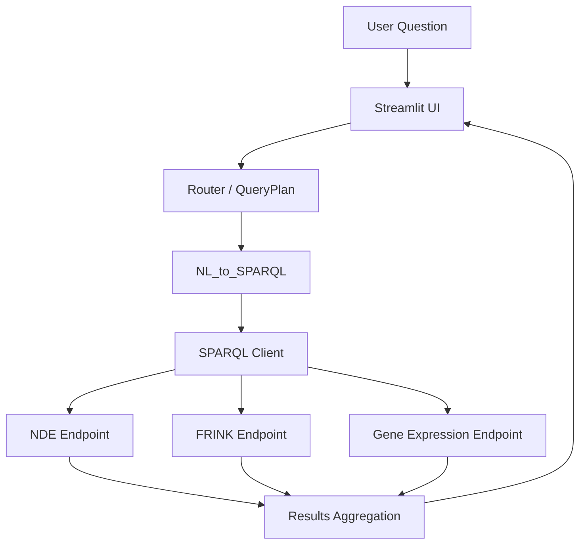

## WOBD Web (Streamlit NL→SPARQL interface)

This subproject provides a Streamlit-based web UI for the OKN-WOBD project.
It turns natural-language questions into SPARQL queries against configured
SPARQL endpoints (e.g. NDE datasets in FRINK and gene expression sources).

The app is **config-driven**: all endpoint URLs and LLM settings live in YAML
config files under `web/configs/`, selected via the `WOBD_CONFIG_PATH`
environment variable.

---

## Local development quickstart

### 1. Activate the project virtual environment

From the repo root, reuse the `.venv` created as described in the main
`README.md`:

```bash
source .venv/bin/activate  # on Windows: .venv\\Scripts\\activate
```

### 2. Install dependencies for the web app

Still from the repo root:

```bash
pip install -e ./web
```

This installs the `wobd-web` package with its dependencies (Streamlit, OpenAI
client, etc.).

### 3. Set your OpenAI API key

The NL→SPARQL component uses OpenAI (model `gpt-4.1` by default):

```bash
export OPENAI_API_KEY="sk-..."  # replace with your key
```

### 4. Run the app (local GraphDB / RDF mode, “Mode B”)

By default, if `WOBD_CONFIG_PATH` is not set, the app uses
`web/configs/demo.local.yaml`, which expects a local SPARQL endpoint at:

- `http://localhost:7200/repositories/nde` (NDE)
- `http://localhost:7200/repositories/geneexpr` (gene expression, optional)

To start the app:

```bash
streamlit run web/app.py
```

Then open the URL shown in the terminal (typically `http://localhost:8501`).

---

## Running with a local GraphDB instance (Mode B)

To back the demo with RDF triples loaded locally, you can run GraphDB via
Docker:

```bash
docker run -d --name graphdb \
  -p 7200:7200 \
  ontotext/graphdb:latest
```

Then:

1. Open `http://localhost:7200` in your browser.
2. Create a repository with ID `nde`.
3. (Optional) Create another repository with ID `geneexpr` for gene expression.
4. Import your RDF files into those repositories via the GraphDB UI.

Once loaded, `demo.local.yaml` will point the web app at these local
repositories.

---

## Running against remote FRINK / production endpoints (Mode A)

To run the app against remote graph endpoints (e.g., FRINK, hosted NDE), use
`web/configs/demo.yaml` or your own config file pointing at the desired
SPARQL URLs.

Example (edit the URLs to match your deployment):

```yaml
sources:
  nde:
    endpoints:
      - id: nde-frink
        label: "NDE via FRINK"
        sparql_url: "https://frink.example.org/nde/sparql"

  frink:
    endpoints:
      - id: frink-main
        label: "FRINK"
        sparql_url: "https://frink.example.org/sparql"
```

Run the app with:

```bash
export WOBD_CONFIG_PATH=web/configs/demo.yaml
streamlit run web/app.py
```

You can create additional YAML configs (e.g., `prod.yaml`, `staging.yaml`) and
select among them by changing `WOBD_CONFIG_PATH`.

---

## Deployment to Streamlit Community Cloud

The web app can be deployed to Streamlit Community Cloud. The deployment uses `web/pyproject.toml` (PEP 621 format with setuptools) for dependency management.

### Deployment Steps

1. **Connect your repository** to Streamlit Community Cloud
2. **Configure app settings**:
   - **Main file**: `web/app.py`
   - **Python version**: 3.11 or higher
3. **Set secrets in Streamlit** (App Settings → Secrets):
   ```toml
   OPENAI_API_KEY = "sk-your-api-key-here"
   WOBD_CONFIG_PATH = "web/configs/demo.yaml"  # Optional: defaults to demo.yaml if not set
   ```
4. **Dependencies**: Streamlit Cloud will automatically install dependencies from `web/pyproject.toml`

The app will use `web/configs/demo.yaml` by default. To use a different config file, set `WOBD_CONFIG_PATH` in Streamlit secrets (as shown above) or as an environment variable in the Streamlit Cloud settings.

---

## UI overview

- **Sidebar**
  - Toggles for **Show generated SPARQL** and **Show provenance**.
  - Toggle **Apply query limit** - controls whether query results are limited to `max_rows` (from config, default: 200). Uncheck to get all results.
  - A list of example questions that pre-fill the main input.
- **Main area**
  - Chat-like history of questions and answers.
  - Latest answer summary text.
  - Tabs per source (e.g., `nde`, `gene_expression`) showing result
    tables.
  - Optional expanders for generated SPARQL and provenance.
  - Info message when query limits are applied (with instructions on how to disable).

### Query Limits

By default, query results are limited to `max_rows` (configured in YAML, default: 200) for **NL→SPARQL queries** to ensure fast response times. **Preset queries** (example questions) do not have limits applied as they are trusted and optimized.

You can disable query limits in two ways:

1. **Sidebar toggle**: Uncheck "Apply query limit" in the sidebar before submitting your question.
2. **Keywords in question**: Include any of these keywords in your question:
   - "all results"
   - "no limit"
   - "remove limit"
   - "unlimited"
   - "show all"

When limits are applied, an info message will appear in the results indicating the limit value and how to disable it.

---

## Architecture (high level)



All endpoint URLs and LLM settings are controlled via YAML config files and can
be switched without modifying application code.

